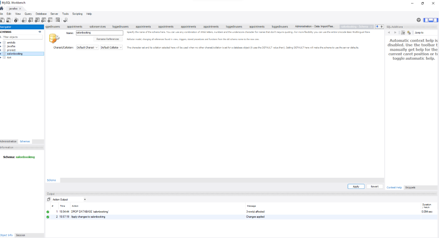
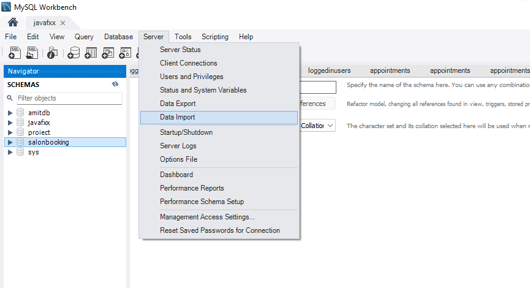
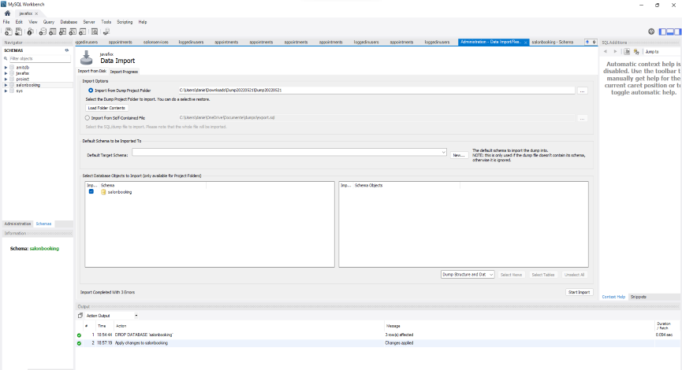

#How to install MySQL Workbench

Follow the steps linked below

* [Install MySQL](https://www.youtube.com/watch?v=OM4aZJW_Ojs&t=321s)

# How to import data in MySQL

Open MySQL and click on your connection.

* Create a new schema called `salonbooking` and click on **Apply**

* After that, click on `Server` and `Data Import`

*Select the Path for the `dump files` and **Start** **Import**. 

Now your DataBase is uptodate and ready to use.